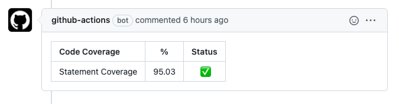

# scoverage-report-gha

[](https://github.com/wishabi/scoverage-report-gha)
[](https://github.com/wishabi/scoverage-report-gha/actions)

This action publishes `sbt-scoverage` test coverage report results as comments in Github PRs.

- Meant to be used in `scala` projects that have Github actions for CI.
- Parses `xml` contents from `sbt-scoverage` reports and extracts useful metrics.
- Creates a markdown formatted comment and posts to Github PR.
- This action was built using templates from [python-container-action](https://github.com/jacobtomlinson/python-container-action)
- The overall execution is inspired by the work done in [jacoco-report](https://github.com/Madrapps/jacoco-report)

Sample output



## Example usage

### v0.5-alpha
```yaml
name: My Workflow
on: [push, pull_request]
jobs:
  build:
    runs-on: ubuntu-latest
    steps:
    - uses: actions/checkout@v2

    # Assuming you have an sbt scala project with scoverage plugin
    - name: Checkout code
      uses: actions/checkout@v2
      
    - name: Generate sbt-scoverage testing and coverage report
      run: |
        /usr/local/bin/platform-param-decrypt_linux > ~/.env
        sbt coverage test coverageReport coverageOff

    # Get changed files from PR
    - name: Get changed files
      if: ${{ github.event.pull_request }}
      uses: jitterbit/get-changed-files@v1
      id: changed-files
      with:
        format: 'json'

    # Get scala version from build (on PR event)
    - name: Get Scala Version
      if: ${{ github.event.pull_request }}
      id: get-version
      run: |
        version=$(echo target/scala* | cut -c14-)
      echo "scala version is ${version}"
      echo "::set-output name=version::$version"
                
    # Then call the report action to post comment to PR (on PR event)
    - name: Run report action
      if: ${{ github.event.pull_request }}
      uses: wishabi/scoverage-report-gha@v0.5-alpha
      id: scoverage
      with:
        repo: ${{ github.repository }}
        pr: ${{ github.event.pull_request.number }}
        token: ${{ secrets.GITHUB_TOKEN }}
        file: target/scala-${{ steps.get-version.outputs.version }}/scoverage-report/scoverage.xml
        minStatementCov: 0.95
        changedFiles: ${{ steps.changed-files.outputs.all }}
        includePackageCov: true
    
    # (Optional) Print test coverage output (on PR event)
    - name: Check outputs
        if: ${{ github.event.pull_request }}
        run: |
        echo "Statement Coverage - ${{ steps.scoverage.outputs.statementCoverage }}"
```

## Tests

```
cd scoverage-report-gha
python3 -m unittest -v
```